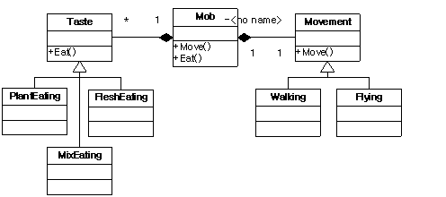
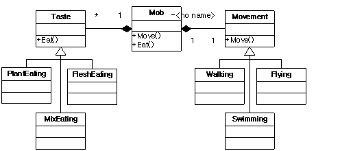

상속과 합성, 그리고 다중 상속...2
====

## 무엇이 문제인가?
---

다소 예가 길어졌고 과장이 많이 섞이긴 했지만 실제 프로젝트에서도 정도의 차이가 있을 뿐 이와 비슷한 경우가 많이 발생합니다. 그 이유는 상속을 통해 기능을 확장하는 것이 쉽고 편하게 '보이기' 때문입니다. 그러나 여기에는 간과하기 쉬운 큰 함정이 도사리고 있습니다. 그 함정이라는 것은 아래에 나와 있는 상속의 두 가지 특징입니다.

1. *상속은 friend 다음으로 강한 클래스간의 결합이다.*
2. *상속은 클래스간의 정적인 구조이다.*

클래스간의 결합이 강하다라는 말은 하나의 클래스의 변화가 다른 클래스에게 끼치는 영향력이 크다라는 것을 뜻합니다. 일반적으로 C++에서 클래스간의 결합도는 friend > inheritance > composition (> aggregation) > dependency 순으로 이루어 집니다.(자바에서는 friend가 없으므로 상속이 가장 강한 결합도를 가진다고 말할 수 있습니다.) 따라서 상속을 이용하게 되면 부모와 자식 클래스 사이에는 (보통 프로그래머들이 생각하는 것 보다 훨씬) 높은 결합도가 형성됩니다.

클래스 구조가 정적이다 라는 말은 해당 클래스간의 구조가 컴파일 시간에 확정되며 따라서 그만큼 변화에 유연하지 못하다 라는 뜻입니다.

둘 다 유지 보수 내지는 재 사용과는 다소 거리가 멀어 보이는 특징이라 할 수 있습니다.
그런데 왜 상속을 하면 재사용하기 편하게 느껴지는 것일까요? 왜냐하면 상속은 기존 소스를 수정할 필요가 거의 없고 비교적 단순한 매카니즘이기 때문에 사용하기 편한데다가 비교적 그 개념이 쉽고 명확하여 초보자도 금방 이해하고 적용할 수 있기 때문입니다. 이것은 일종의 ‘망치의 오류’입니다. 상속이 편하니 모든 것을(심지어 하지 말아야 할 것도) 다 상속으로 처리하겠다는 것입니다. 객체 지향에 대해 우리가 가지고 있는 가장 대표적인 미신입니다.

여기서 첫 부분에서 소개한 객체 지향 개념들을 다시 언급해 보겠습니다.

1. *상속은 기능의 확장이 아니라 클래스들을 분류하는 수단이다.*
2. *객체는 책임이 있는 어떤 것이다.*
3. 캡슐화는 데이터, 인터페이스, 클래스, 시스템 등 구현 가능한 모든 것에 대한 은닉이다.

1번의 의미를 제대로 이해하기 위해 실생활에서 우리가 어떤 것을 ‘분류’한다는 것이 무엇인지 한번 생각해 보겠습니다. ‘분류’라는 말은 ‘어떤 동일한 잣대에 의해 체계를 갖는 것’을 의미합니다. 예를 들어 텔레비전, 냉장고, 에어컨 등은 ‘가전 제품’으로 분류가 될 수 있습니다. 그리고 이 때 분류를 위해 사용된 기준은 ‘집안에서 사용하는 전자 제품’입니다. 따라서 자동차나 식탁은 가전 제품으로 분류할 수 없을 것입니다. 왜냐하면 그 기준이 다르기(전자 제품이 아니므로) 때문입니다. 비슷하게 오실로스코프 역시 가전 제품이 될 수는 없습니다. 비록 오실로스코프가 ‘전자 제품’이긴 하지만 (대개의 경우) 집에서 사용하지는 않기 때문입니다.

그렇다면 객체 지향 설계 시 상속을 통해 클래스를 분류할 때 그 분류 기준은 어떻게 정해야 할 것인가 하는 문제가 남았습니다. 이것은 2번에 의하여 객체가 가진 책임 즉, 인터페이스가 됩니다. 여러 가지 이유를 들 수 있겠지만 결정적으로 우리가 다형성을 이용할 때 그 수단이 되는 것이 인터페이스이기 때문입니다.(사실 다형성을 이용하지 않는다면 이러한 논의 자체가 의미가 없을 것입니다.)
이제 위의 예가 가진 문제점을 살펴 보겠습니다.

위의 클래스 구조는 분류가 잘못된 상속 구조입니다. Mob이 애초에 분류하기로 정한 기준은 Move입니다. 그런데 기능이 추가되면서 그 분류 기준에 Eat가 추가되었습니다. 그러나 하위 클래스인 WalkingMob과 FlyingMob은 Move에 의해서만 분류가 되는 클래스들입니다. 이것은 ‘집안에서 사용하면서 동시에 전자 제품’인 가전 제품 분류에 식탁(집에서 사용)이나 오실로스코프(전자 제품)가 포함되는 것과 유사합니다.

물론 이것도 올바른 상속 구조가 될 수 없습니다. WalkingMob과 PlantEatingMob은 동일한 분류 기준을 가지고 있지 않습니다.

마지막으로 3번째 정의에 대해 이야기 해보겠습니다.

1. 상속은 기능의 확장이 아니라 클래스들을 분류하는 수단이다.
2. 객체는 책임이 있는 어떤 것이다.
3. *캡슐화는 데이터, 인터페이스, 클래스, 시스템 등 구현 가능한 모든 것에 대한 은닉이다.*

여기에 첨언하여 * ‘캡슐화는 가변성에 대한 은닉이다’*라는 말을 덧붙이고 싶습니다.

우리가 재 사용성을 높이고 유지보수를 쉽게 하겠다는 말의 뜻은 알고 보면 ‘기존 소스가 새로이 추가되거나 변경되는 부분에 대한 영향을 받게 하지 않겠다(혹은 최소화하겠다)’라는 뜻입니다. 따라서 이렇게 하기 위해서는 추가되거나 수정이 이루어 지는 부분을 캡슐화해야 합니다. 그런데 위의 상속 구조는 매우 강한 결합이기 때문에 이렇게 추가되는 기능에 대한 캡슐화에 적합하지 않습니다.

자, 이제 문제점을 알았으니 해결책에 대해 이야기 할 시간입니다.

**합성을 이용하자**

근래 몇 년 사이에 발표된 혹은 출간된 객체 지향 관련 글들이 공통적으로 강조하는 설계 원칙 중 하나는 ‘가급적 상속 대신 합성을 이용하라’ 입니다. 자세한 이유에 대해서는 뒤에서 설명하도록 하고 우선 위의 예제를 위에서 언급한 내용들을 토대로 다시 구현 해 보도록 하겠습니다.

우선 최초의 요구 사항은 ‘두 가지 세부 구현으로 나뉠 수 있는 Move기능 구현’입니다. 따라서 여기서 Mob 객체의 책임(인터페이스)는 Move()가 되고 가변성이 발생되는 것은 Move의 동작 방식입니다. 여기서는 두 가지 선택이 가능합니다.

1. Mob 자체를 동작 방식의 변화에 대해 캡슐화하는 경우 -> 상속 이용
2. 가변성에 대한 별도의 캡슐화 클래스를 사용하는 경우 -> 합성 이용

위에서 가급적 상속보다는 합성을 이용하라고 했으므로 2번을 선택하도록 합니다.(1번을 선택해도 큰 문제는 없습니다.)

2번을 선택하였으므로 가변성을 캡슐화하는 별도의 클래스가 필요합니다. 여기서는 그 클래스의 이름을 Movement라고 하였습니다. 이 Movement는 Move()라는 인터페이스를 가지며 구현 방식의 가변성을 캡슐화하는 책임을 가집니다. 그리고 Move라는 분류 기준에 의해 Walking과 Flying이라는 클래스가 상속됩니다. 이제 이 새로 만들어진 기능을 아래 그림과 같이 Mob 클래스에 추가합니다.

처음에 비해 Movement라는 쓸데없는 클래스가 더 생긴 점이나 Mob에서 Movement객체를 관리하는 코드들이 더 추가되어야 한다는 점이 못마땅할 지 모르지만 어쨌든 계속 진행해 보겠습니다. 이제 팀장이 와서 Eat() 기능을 추가해 달라고 합니다.

역시 여기서도 두 가지 선택이 가능합니다만 계속 2번 방식을 이용해 보겠습니다. 이번에는 Taste라는 클래스를 만듭니다. 이 클래스는 Eat()라는 인터페이스를 가지며 역시 구현 방식의 가변성을 캡슐화하는 역할을 수행합니다. 그리고 동일한 분류 기준을 가진 PlaintEating과 FleshEating 클래스를 상속합니다.

마지막으로 새로 구현된 기능을 Mob에 적용하기 위해 Eat()인터페이스를 추가합니다. 이 인터페이스는 단지 Taste클래스의 인터페이스를 호출하는 역할을 수행합니다.
결과는 아래와 같습니다.

이제 도움 안 되는 동료들에 의해 잡식성 Mob을 추가해야 할 때입니다. 잡식성이라는 기능은 Taste 클래스의 분류 기준에 포함되므로 상속을 이용하면 됩니다.

단지 MixEating이라는 클래스를 하나 추가해줌으로써 모든 것이 명확하게 처리가 됩니다. 추가된 기능은 이미 정의된 책임에 대한 가변성에 해당하며 이것은 Taste 클래스에 의해 잘 캡슐화가 되어있으므로 더 이상 수정해 줘야 할 것들이 아무것도 없습니다.(물론 아주 이상적인 경우이겠지만)

이제 마지막으로 개념 없는 기획팀 직원의 아이디어를 반영할 차례입니다. 그가 말한 바다 생물을 위해서는 Swimming이라는 동작 방식이 필요하므로 Movement클래스에 Swimming이라는 자식 클래스를 만들어 줍니다. 그리고 이 기능 역시 기존의 Movement클래스에 의해 캡슐화 되어 있으므로 다른 부분에 영향을 끼치지 않고도 매끄럽게 기능 추가가 이루어 집니다.

<구조 4>

자 이제 왠지 기획팀 직원에 대한 적개심이 눈 녹듯 사라지는 것이 느껴지지 않습니까?(따라서 더 이상 기획팀 직원을 어떻게 하면 물 먹일 수 있을까 고민하며 괴로워할 필요도 없습니다.) 기능 추가가 더 이상 노가다가 아닌 아주 간단한 작업이 돼버렸습니다. 게다가 이제는 가상 함수 추가나 기존 기능 수정을 위해 전체를 고칠 필요가 없습니다. 단지 (이전 보다 훨씬 적은) 몇몇 관련 클래스들만이 유지 보수에 영향을 받을 뿐입니다. 그리고 이것은 그만큼 기능 수정에 따른 예기치 못한 버그가 발생할 확률이 더 적다는 것을 의미하며, 프로젝트 마감이 다가 오더라도 해야 할 일들이 기하급수적으로 늘어나지는 않을 것 같다라는 뜻이기도 합니다.

**상속과 합성의 조합**

물론 위의 예제는 (대부분의 책들이 그렇듯이) 매끄러운 진행을 위해 인위적으로 조작된 시나리오에 불과합니다. 따라서 과장도 많고 지나치게 이상적인 상황을 연출하긴 했지만 뭐…이 바닥이 다 그런 것 아니겠습니까?

다만 여기서 가장 핵심적인 사항은 상속을 이용하지 말라가 아니라 상속을 남용해서는 안 된다는 점이며 상속이 남용되었는지 그렇지 않은지를 판단하는 척도는 자식 클래스가 동일한 분류 기준에 의해서 분류가 가능하냐는 것으로 판단할 수 있다는 것입니다.

‘상속이 기능의 확장이 아니라 클래스를 분류하기 위한 수단이다.’ 라는 말의 의미는 바로 이런 것입니다. 따라서 아래와 같은 방식 역시 괜찮은 설계가 될 수 있습니다.(그러나 개인적으로는 구조<4>를 더 추천하고 싶군요.)

<구조 5>

여기서 Mob은 식성이라는 동일한 분류 기준을 가지고 상속이 이루어 졌으며 Movement 역시 마찬가지입니다. 그리고 Mob은 Movement와 합성 관계를 통해 기능을 추가하고 있습니다. 이 경우 Mob의 인터페이스는 Eat()와 Move()인데 Eat()는 동적 다형성에 의해 가변성 처리가 이루어 지며 Move()는 Mob가 포함하고 있는 Movement 객체가 가진 캡슐화에 의해 가변성이 처리됩니다.

상속에 대한 개념을 바꾸는 것 하나만으로도 우리는 유지 보수에 용이하고 훌륭한 객체 지향 설계를 할 수 있습니다. <구조 4>와 <구조 5>는 이렇게 수정된 상속과 객체에 대한 정의를 토대로 나올 수 있는 설계 구조입니다.