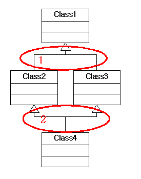

상속과 합성, 그리고 다중 상속...3
====

## 과연 다중 상속은 나쁜 것인가?
---

자 이제 한 단계 더 나아가 <구조 2>에 대해 다시 생각해 보겠습니다.


<구조 2>

이것은 우리가 다중 상속 구조를 생각하면서 만들어본 클래스 구조도 입니다. 여기서 윗 부분만 놓고 생각해 보자면


이 구조는 바람직한 상속 구조를 가지고 있습니다. 단지 우리는 이 두 계층도를 연결할 때 합성 관계를 이용하게 되면 좋은 구조라고 말했고 다중 상속을 이용하면 안 좋은 구조라고 말했습니다. 그런데…정말 그럴까요? 정말 다중 상속은 저주 받은 속성일까요? 왜 사람들은 다중 상속을 피해야 한다고 말을 할까요? 왜 자바에서는 다중 상속을 허용하지 않았을까요? 그 이유는 바로 다중 상속이 중복 상속의 위험성에 노출되어 있기 때문입니다. 이 말을 뒤집으면 중복 상속의 위험성이 없는 한 다중 상속은 전혀 거리낄 것이 없다는 뜻입니다. 즉, 아래 구조도에서




*문제가 되는 부분은 2가 아니라 1*인 것입니다. 그럼 1과 같은 구조가 생기지 않도록 하려면 어떻게 해야 하는가? 이것에 대한 해답은 이미 이전 단락에서 나왔습니다. 즉, 동일한 분류 기준으로 상속을 수행하면 됩니다. 생각해 보십시오. 동일한 분류 기준을 가진 클래스들을 다중 상속해야 할 필요가 있을 까요? 위의 다중 상속 Mob에서도 다중 상속이 필요한 경우는 Walking-PlantEating(혹은 FleshEating), Flying-PlantEating(혹은 FleshEating) 과 같은 경우였지, Walking-Flying, PlantEating-FleshEating 이런 식의 다중 상속을 하지는 않았습니다. 결국 위와 같은 원칙만 잘 지켜준다면 (중복 상속이 발생할 수 없으므로)다중 상속은 전혀 문제 될 것이 없습니다.

하지만 다중 상속에는 또 다른 (때에 따라서는 사소한) 문제가 숨어 있다고 앞에서 언급했었습니다. 즉, 다형성을 이용한 통일된 처리가 불가능하다는 것입니다. 아래 소스를 한번 보시기 바랍니다.

```cpp
class Movement
{
public:
    virtual void Move() = 0;
}

class Walking : public Movement
{
public:
    void Move() { std::cout << “I can walk ”; }
}

class Flying : public Movement
{
public:
    void Move() { std::cout << “I can fly ”; }
}

class Taste
{
public:
    virtual void Eat() = 0;
}

class PlantEating : public Taste
{
public:
    void Eat() { std::cout << “I like vegetables ” }
}

class FleshEating : public Taste
{
public:
    void Eat() { std::cout << “I like meats ” }
}

class PlantEatingAndWalkingMob : public Walking, public PlantEating
{
}

class FleshEatingAndFlyingMob : public Flying, public FleshEating
{
}
```

이제 PlantEatingAndWalkingMob과 FleshEatingAndFlyingMob 은 더 이상 통일된 인터페이스 처리가 불가능합니다. Movement 포인터형을 이용할 경우 Move()함수 호출은 가능하지만(그리고 다형적으로 처리가 되겠지만), Eat()함수 호출은 불가능합니다. 반대로 Taste 포인터형을 이용하면 Eat()만 처리가 가능합니다.

한 가지 시도해 볼 수 있는 것은 dynamic_cast<>를 이용하는 것입니다. 즉, 어느 하나의 포인터 형으로 객체들을 관리하고 반대쪽 함수를 호출할 때는 해당 포인터 형으로 변환하여 처리하도록 구현하는 것입니다. 예를 들자면 아래와 같이 처리하는 것이지요

```cpp
std::vector<Movement*> mobArr;
mobArr.push_back(…);
…
/// 생성된 객체를 모두 여기에 집어 넣는다.

std::vector<Movement*>::iterator b = mobArr.begin(), e = mobArr.end()
while (b != e)
{
    (*b)->Move();
    dynamic_cast<Taste*>(*b)->Eat(); /// Eat() 호출 시     Taste형으로 변환하여 처리
    ++b;
}
 ```

이 경우 우선 프로그래머가 일일이 형 변환을 지정해 줘야 한다는 불편함과 함께 dynamic_cast<>에 대한 오버 헤드 부담이 뒤 따르게 됩니다. dynamic_cast<>는 RTTI 매카니즘에 의해 객체의 형 정보를 검색하여 처리를 해줘야 하므로 static_cast<>와 같은 다른 변환 연산자 보다 수행 시간이 많이 걸립니다. 결국 사용하기도 불편하고 성능도 떨어지는, 합성을 이용하는 것보다 나은 점이 조금도 없는 구조입니다.

그렇다면 어떻게 해야 할까요? 간단합니다. 이런 경우 그냥 합성을 이용하면 됩니다. 무슨 뜬금없는 소리냐구요? 다중 상속 이야기를 먼저 꺼낸 사람이 누군데 이제 와서 그냥 사용하지 말라니…참으로 무책임하기 짝이 없다구요?

사실 여기서 제가 정말로 하고 싶었던 말은 *다중 상속은 단일 상속과 다르게 생각해야 한다*는 것입니다. 사실 우리는 크게 볼 때 다음 두 가지 목적을 위해서 상속을 사용합니다.

1. 동적 다형성 이용
2. 정말 순수하게 부모 클래스의 기능 재사용

1번을 '인터페이스 상속'이라고 하며, 2번을 '구현 상속'이라고 합니다. 지금까지 이야기했던 것은 1번의 경우에 대한 이야기였습니다. 그리고 많은 객체 지향 설계 기법(특히, 디자인 패턴에 소개된 대부분의 설계 패턴)은 1번을 위해 상속 구조를 이용합니다. 즉, 동일한 인터페이스를 기준으로 세부 구현을 위한 가변성 부분은 하위 클래스에게 위임하는 구조입니다.

그러나 실제 프로젝트를 수행하다 보면 다형성을 위한 목적이 아니라 정말로 순수하게 프로그래머가 원하는 기능이 미리 구현되어 있는 클래스의 기능을 단순히 물려받고 싶은 경우, 혹은 여러 클래스에서 공통된 특성을 필요로 하여 그런 특성을 별도의 단위 전략 클래스로 만들어 재사용하고 싶은 경우가 있습니다. 예를 들어 기존의 클래스 라이브러리(MFC가 제공하는 API클래스나 STL의 컨테이너 클래스들)의 기능에 자신만의 추가적인 기능을 구현하고 싶을 지도 모릅니다. 이럴 땐 부모 클래스의 인터페이스를 필요로 하는 것이 아니라 정말 이미 구현된 기능 그 자체를 필요로 하는 것입니다. 다중 상속이 사용되는 것은 바로 이런 순간입니다.

다시 위의 Mob 클래스를 생각해 볼 때, 전체 객체들을 동일한 알고리즘을 통해 처리할 필요 없이 그냥 각각의 특성을 가진 Mob 별로 별도의 처리를 하겠다고 생각했다면 (즉, 어떤 공통된 인터페이스를 통한 처리를 완전히 포기하고 그 때 그 때 필요한 객체를 생성해서 사용하기 위한 목적으로 클래스를 이용한다면) 다중 상속도 괜찮은 선택이 될 수 있습니다. 아니 오히려 이 경우 다중 상속은 합성을 이용하는 것보다 더 좋습니다. 왜냐하면,

첫째, 합성을 이용할 경우 해당 추가되는 기능 클래스 객체를 다루기 위한 별도의 멤버가 필요하고 추가적인 리소스 처리 기능을 구현해 줘야 합니다. JAVA와 달리 C++에서는 이 리소스 처리가 항상 프로그래머의 발목을 잡습니다. 특히나 멀티 쓰레드 상황에서는 더더욱 골치 아픈 존재가 될 수 있습니다. 그러나 상속을 이용할 경우 이런 별도의 멤버 처리가 필요 없습니다.

둘째, 추가되는 기능에 대해서 wrapping함수를 추가해 줘야 하므로 기존 클래스의 수정이 불가피합니다. 하지만 상속의 경우 이런 것이 필요 없습니다. 게다가 wrapping함수를 이용한다라는 것은 간접 호출에 대한 실행 시간 비용이 발생한다는 것을 의미합니다. 물론 inline 처리가 될 경우 이런 비용이 무시될 수 있습니다만 보장된 사항은 아닙니다.(대개의 경우 컴파일러는 인라인 처리를 해줍니다.), 하지만 상속은 항상 직접 호출이 가능합니다.
셋째, 합성의 경우 모든 인터페이스를 가상 함수로 처리해줘야 합니다. 그러나 다중 상속을 이용하면 그럴 필요가 없습니다.(어차피 다형성을 의도하지 않았으므로)

하지만 다중 상속이 꼭 장점만 있는 것은 아닙니다. 결정적으로 다중 상속은 기능 추가 시 마다 추가해 줘야 할 클래스의 개수가 많아 지는 점이 문제입니다. 그리고 이런 작업의 대부분은 단순한 copy&paste 인 경우가 많습니다. 즉, 처음 예제의 경우 다중 상속을 이용했을 때 Swimming기능이 추가될 경우 만들어 줘야 할 클래스의 개수는 4개가 됩니다.(Swiiming 클래스 1, 이것을 상속 받는 클래스 3) 그리고 이런 것들은 기능이 추가될 때마다 기하 급수적으로 늘어날 것입니다. 자 이제 C++만이 가지는 장점이 빛을 발하는 순간입니다.

C++에는 템플릿이라는 다른 언어에는 없는(얼마 전 자바에서 JDK 1.5가 나오면서 템플릿 기능이 추가되긴 했지만 어쨌든) 막강한 무기가 있습니다. 그리고 이 템플릿은 다중 상속과 기가 막힌 궁합을 자랑합니다. 위의 Mob 예제를 템플릿과 다중 상속을 이용하여 처리하면 아래와 같습니다.

```cpp
class Movement
{
public:
    void Move(); /// 정의는 필요 없고 단지 선언만(가상함수가 아니어도 됨)
protected:
    ~Movement() {}
};

class Walking : public Movement
{
public:
    void Move() { std::cout << “I can walk ”; }
};

class Flying : public Movement
{
public:
    void Move() { std::cout << “I can fly ”; }
};

class Taste
{
public:
    void Eat(); /// 역시 정의는 필요 없고 단지 선언만(물론 이것도 가상함수가 아니어도 됨)
protected:
    ~Taste() {}
};

class PlantEating : public Taste
{
public:
    void Eat() { std::cout << “I like vegetables ”; }
};

class FleshEating : public Taste
{
public:
    void Eat() { std::cout << “I like meats ”; }
};

template <class TasteType, class MoveType>
class Mob : public TasteType, public MoveType
{
};
```

이게 전부 입니다. 이제는 필요할 때마다 해당 클래스 객체를 아래처럼 적절하게 정의해 주면 됩니다.

```cpp
Mob<FleshEating, Walking> ogre;
Mob<FleshEating, Flying> wyvern;
Mob<PlantEating, Walking> gnome;
```

만약 Swimming 동작이 추가되면 해당 클래스만 정의해주면 됩니다.

```cpp
class Swimming : public Movement
{
public
    void Move() { std::cout << “I can swim ”; }
};
```

그리고 필요한 부분에서 해당 클래스 객체를 정의합니다.

```cpp
Mob<FleshEating, Swimming> shark;
```

이제 Mob 클래스는 합성을 이용할 때처럼 별도의 멤버 객체를 다루는 루틴을 추가해야 하거나 추가된 인터페이스를 위한 wrapping 함수를 구현해야 할 필요도 없으며 매번 다량의 클래스를 정의해 줘야 할 필요도 없이 간단하게 기능 확장/수정이 가능합니다.

이런 편의성에 덧붙여 이젠 더 이상 가상 함수나 wrapping 함수가 갖는 추가적인 오버 헤드가 발생하지 않습니다. 심지어 위의 예제 소스 같은 간단한 함수의 경우 바로 인라인 처리가 가능하며 그런 경우 해당 함수 호출에 대한 어떠한 비용도 지불할 필요가 없습니다. 그뿐만이 아닙니다. 이젠 가상 테이블이 더 이상 필요 없고 기능 추가에 따른 멤버 추가가 없어져서 메모리 면에서도 훨씬 효율적입니다.

결정적으로 위의 모든 장점을 뛰어넘는 진정한 템플릿의 비밀 병기가 있으니 바로 템플릿 특화(template specialization) 입니다. 템플릿 특화를 이용하면 기존 소스를 전혀 건드리지 않고도 예외적인 기능 구현이 가능합니다. 가령 예전에 그 개념 없는 기획팀 직원이 바다에 사는 육식 동물은 주인공을 공격할 뿐만 아니라 배도 공격하도록 하자 라는 새로운 주장을 펼치고 역시 여러분을 제외한 모두의 찬성에 의해 그러한 기능을 구현해야 한다면 <구조 4>와 같은 합성 구조에서는 매우 까다로운 처리가 필요합니다.

왜냐하면 Movement와 Taste클래스는 서로 간에 완전히 분리된 클래스들이기 때문에 Swimming 클래스에서는 Mob객체가 FleshEating 객체를 사용하는지 PlantEating 객체를 사용하는지 알 방법이 없기 때문입니다. 결국 별도의 상태 변수를 추가해서 복잡한 if else 처리를 해줘야 하거나 이 경우에 대해서만 동작하는 별도의 예외 클래스를 정의해 주거나 어쨌든 특별한 처리가 필요 합니다. 어떤 경우든 기존 소스의 수정이 불가피하며 이런 일이 반복되어 애써 잘 만든 소스가 너덜너덜해 지기 전에 뭔가 새로운 패턴을 적용하기 위해 골머리를 썩혀야 합니다.

그러나 템플릿 특화를 이용하면 아주 세련된(그리고 매우 간단한) 처리가 가능합니다. 즉, 예외적인 처리가 필요한 Eat()함수에 대해서 아래와 같이 템플릿 특화를 적용합니다.

```cpp
template <class TasteType, class MoveType>
class Mob : public TasteType, public MoveType
{
public:
    void Eat() { TasteType::Eat(); } /// 템플릿 특화를 위한 재정의
};

template<>
void Mob<FleshEating, Swimming>::Eat()
{
    /// 기존 기능에 배를 삼키는 기능 추가
}
  ```

이렇게 하면 다른 객체들의 Eat() 호출은 기존 방식대로 수행될 것이며 단지 Mob<FleshEating,Swimming> 템플릿 클래스의 객체에 대해서만 별도의 특화된 Eat()함수가 호출될 것입니다. 이제 원하는 기능은 구현되었으며 그 외에 여러분이 해줘야 할 것은 아무것도 없습니다!

**무엇을 언제 어떻게 사용할 것인가?**

대부분의 경우 프로젝트는 항상 변하며 요구 사항 역시 언제나 달라집니다. 또한 이미 완료된 프로젝트라 하더라도 차후 기능 변경이나 추가는 수시로 이루어 집니다. 따라서 프로그래머 역시 유연한 사고가 필요합니다. 어떤 기능 수정이나 추가 시 지금까지 상속으로 처리했으니 끝까지 상속만 이용 한다거나 반대로 합성만을 고집하는 것은 결국 기계적인 반복 작업 속에 점점 경직된 구조의 프로그램을 만들게 됩니다. 따라서 정작 프로젝트를 수행하다 보면 ‘코딩 스타일은 자유롭고 설계는 매우 경직되는’ 경우를 많이 보게 됩니다. 이런 소스는 유지 보수가 어렵고 가독성이 떨어지며 예상치 못한 버그에 시달리는 쓰레기 소스가 돼버립니다. 결국 고심 끝에 해당 소스는 폐기되고 아예 처음부터 새롭게 다시 짜는 경우가 발생합니다.

좋은 프로그래밍이 이루어 지려면 반대로 *코딩 스타일은 빈틈없고 단단해야 하며 설계는 유연해야 합니다.*

가장 중요한 것은 구현 방식을 결정하기에 앞서 전제 조건이 무엇인지, 기능 구현의 목적이 무엇인지를 파악하는 것입니다. 제 글의 마지막에서 템플릿을 통한 다중 상속이 좋다고 신나게 떠들어 댔지만 만약 Mob을 다형적으로 이용해야 하는 조건이 필요하다면 이 모든 것이 ‘말짱 황’ 입니다. 그냥 군말 없이 합성을 이용한 단일 상속 구조로 가야 합니다. 소프트웨어 설계는 *모든 상황에 완벽한 해결법은 없지만 특정 상황에 더 나은 해결책은 있기 마련입니다.* 그리고 그러한 더 나은 해결 방안을 찾아 내는 것이 우리 개발자가 해야 할 역할 입니다.

**참고 자료들**

이 글과 관련하여 제가 참고하였거나 기타 도움이 될 만한 자료나 참고 서적들을 몇 개 추려봤습니다.

 알기 쉬운 디자인 패턴 : Alan Shalloway, James R. Trott 저, 원제 : Design patterns explained : A New Perspective on Object Oriented Design, 우리말 번역본 제목이 주는 느낌과 달리 절대 초보자를 위한 책은 아닙니다. 오히려 개인적으로는 실무에서 객체 지향 언어를 이용하여 프로젝트를 수행했거나 계속 수행 중인 사람들, 특히 디자인 패턴을 이용해서 뭔가 해보려다가 뜻대로 되지 않아 좌절했을 법한 많은 실무 개발자들을 위한 책이라 생각합니다. 이 책의 부제가 말해 주듯이 객체 지향 설계에 대한 저자의 깊은 통찰력을 느낄 수 있습니다. 이 책은 디자인 패턴뿐 아니라 객체 지향 설계 전반에 대한 새로운 안목을 키울 수 있는 좋은 책입니다.

 Modern C++ Design : Andrei Alexandrescu 저, 안드레이는 템플릿을 이용한 제네릭 프로그래밍 분야에서 세계적으로 가장 앞서나가는 인물 중 한 명입니다. 그리고 이 책은 그런 안드레이의 템플릿을 이용한 화려하고 난해한 테크닉들이 난무하는 책입니다. 따라서 그런 테크닉적인 부분에 압도되어 본질적으로 그가 주장하는 많은 부분을 놓치기 쉽습니다. 만약 제네릭 프로그래밍에 관심이 많은 분이라면 꼭 이 책을 끝까지 읽어 보시기 바라며 혹시 그렇지 않은 분이라도 1장만큼은 꼭 읽어 보시기 바랍니다. 단위 전략 클래스를 이용한 설계 기법에 대해 설명해 놓은 1장 부분은 객체 지향 설계에 대한 새로운 안목을 넓힐 수 있는 좋은 내용으로 가득 차 있습니다.

 JAVA 프로그래머를 위한 UML, 실전에서는 이것만 쓴다. : Robert C. Martin 저, 원제 : UML for JAVA Programmers, UML과 객체 지향 설계에 대해 매우 실용적인 시각에서 설명을 하고 있습니다. 이 책을 반드시 살 필요는 없습니다. 다만 서점에서 11장 만큼은 반드시 읽어 보시기 바랍니다. 객체 지향 설계 시 우리가 유의해야 할 점들에 대해 잘 설명해 놓았습니다.

 Thinking in JAVA : Bruce Eckel 저, 저는 자바를 배우기 시작한 지 얼마 되지 않았습니다. 그러나 비록 짧은 기간이지만 자바를 공부해 보면서 느낀 점이라면 자바는 객체 지향 프로그래머라면 한 번쯤 공부해볼 필요가 있는 언어이다 라는 것입니다. 언어의 우수성, 안전성 뭐 이런 논란 거리가 될만한 것들을 떠나서 자바가 제공하는 클래스 API 들의 상당수가 객체 지향적으로 바람직한 구조를 가지고 있으며 디자인 패턴을 적용하였거나(가령 스트림 클래스들 중 필터 클래스들은 Decorator 패턴을 이용하고 있습니다.) 아예 디자인 패턴 사용을 용이하게 하는 클래스들도 있습니다.(예를 들어 Observer 관련 클래스들) 따라서 자바를 공부하는 것은 객체 지향 설계나 디자인 패턴에 대한 이해도나 응용력을 높이는데 많은 도움이 될 수 있습니다. 이 책은 자바 언어를 설명하는 가장 유명한 책 중 하나이면서 인터넷을 통해 공식적이고 합법적으로 e-book을 구할 수 있는 몇 안 되는 책이기도 합니다.

 The Liskov Substitution Principle: 흔히 줄여서 LSP라고 말하는 유명한 객체 지향 설계 원칙에 대한 짧은 논문입니다.(구글에서 검색해보시면 쉽게 PDF문서를 찾으실 수 있습니다.) 짧지만 아주 좋은 글입니다.
 The Open-Closed Principle: LSP만큼이나 널리 알려진 객체 지향 설계 원칙에 대한 글입니다.(이 글 역시 구글에서 쉽게 검색이 가능합니다.) 역시 객체 지향 프로그래머라면 반드시 읽어둬야 할 글이라 생각합니다.

모쪼록 제 부족한 글이 약간이나마 도움이 되셨기 바랍니다.