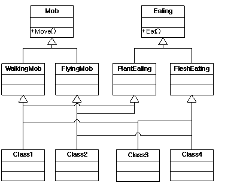
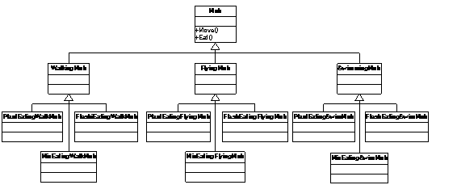
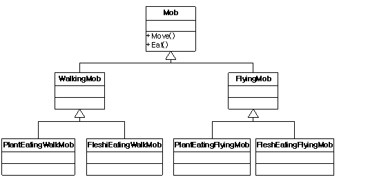
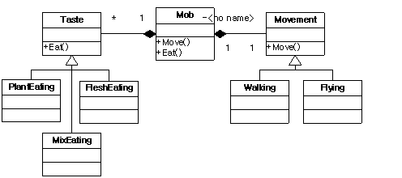
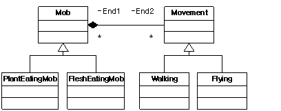
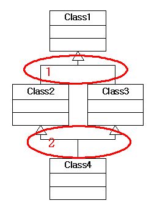

상속과 합성, 그리고 다중 상속...1
====

## 상속이냐 합성이냐 그것이 문제로다.
## 객체 지향 설계에 대한 미신
---

불과 10여 년 전만 하더라도 객체 지향 프로그래밍은 많은 이들에게 낯설게만 느껴졌지만(혹시 저만 그랬던가요?) 이제는 C++나 JAVA와 같은 객체 지향 언어들이 다수의 소프트웨어 개발자들에게 지지를 받고 있고 최근에 나오는 수많은 개발 방법론들이 대부분 객체 지향을 기반으로 하고 있을 만큼 소프트웨어 업계 전반적으로 객체 지향 기법 및 이론들이 널리 퍼져 있습니다. 그러나 이런 폭넓은 인프라에도 불구하고 아직까지 많은 책들과 대학 수업에서 객체 지향에 대해서 시대에 뒤떨어졌거나 심지어는 잘못된(정확히 말하자면 잘못된 생각이었고 이제는 수정되어야 할) 내용들을 언급하거나 가르치고 있는 것이 현실입니다.

따라서 이 글에서는 실제로 프로젝트에서 합리적인 객체 지향 설계를 위해 우리가 버려야 할 과거의 인습 중 몇 가지에 대해서 언급하고자 합니다.(참고로 이 글은 많은 부분 '알기 쉬운 디자인 패턴(원제 : Design Patterns Explained, Alan shalloway, James R. Trott 저)'의 8장 내용을 토대로 하고 있습니다.)

과거에 잘못 소개된 객체 지향 개념들 중 대표적인 것은 다음과 같습니다.

1. 상속은 기능의 확장이다.
2. 객체는 데이터+메소드이다.
3. 캡슐화는 데이터 은닉이다.

'알기 쉬운 디자인 패턴'에서 저자는 위의 개념들이 다음과 같이 수정되어야 한다고 주장하고 있습니다.

1. 상속은 기능의 확장이 아니라 클래스들을 분류하는 수단이다.
2. 객체는 책임이 있는 어떤 것이다.
3. 캡슐화는 데이터, 인터페이스, 클래스, 시스템 등 구현 가능한 모든 것에 대한 은닉이다.

3번에 대해서는 쉽게 수긍이 갑니다.(여러분도 수긍이 가실 것입니다.) 아마도 이것은 진정한 객체 지향 설계를 위해서는 단순히 데이터 은닉을 위한 캡슐화가 아닌 보다 공격적이고 광범위한 캡슐화가 필요하다는 뜻일 것입니다.(그리고 실제로도 단순히 데이터를 숨기기 위한 목적으로 캡슐화를 하지는 않습니다. 그런데도 많은 객체 지향 책에서 아직도 information hiding이 어쩌구 하면서 마치 encapsulation = information hiding인 것처럼 설명함으로써 진정한 캡슐화의 의도를 흐리고 있습니다.)

2번에 대해서는 약간 고개를 갸웃거릴 수 있을 지 모르겠습니다. 책임 있는 어떤 것이라니...쉽게 마음에 와 닿지 않는 표현입니다. 이것을 쉽게 이해하려면 먼저 인터페이스라는 용어를 알고 있어야 합니다. 인터페이스를 단순히 C++ 구현 관점에서 설명하면 외부에서 호출 가능한(즉, public) 멤버 함수라 할 수 있습니다. 그런데 이 외부에서 호출 가능한 멤버 함수(이것을 객체 지향 이론에서는 다른 말로 메소드라고 합니다.)는 설계 관점에 다시 보면 결국 해당 객체가 수행해야 할 기능 목록들입니다. 왜냐하면 객체를 사용하는 입장에서는 호출을 했으면 어쨋든 해당 호출에 대한 어떤 처리를 객체가 해줄 것이라 생각할 것이고 그렇지 않으면 프로그램이 정상적으로 동작하지 않을 것이기 때문입니다. 예를 들어,

```cpp
class Circle
{
public:
   void Draw();
}

Circle d;
```

이런 클래스와 객체가 있다면 `d.Draw()`라고 했을 때 사용자는 d라는 객체가 Draw()함수에 대한 어떤 동작을 수행하리라 기대합니다. 따라서 d라는 객체는 Draw()에 대한 적절한 동작을 수행할(여기서 말하는 동작을 수행 한다는 의미는 실제 어떤 구현을 해야 한다는 의미라기 보다 단순히 해당 호출을 받아 들인다는 의미로 이해하시기 바랍니다.) '책임'이 있습니다. 2번에서의 '책임'이라는 말의 의미는 이런 인터페이스를 의미한다고 보시면 됩니다.

이 개념은 객체를 데이터의 집합이 아니라 인터페이스의 집합으로 봐야 한다는 것을 내포하고 있습니다.(이것이 class가 C의 structure와 구별되는 진정한 차이점입니다.) 그리고 이것은 우리가 클래스를 설계할 때 이렇게 인터페이스를 기준으로 설계해야 한다는 것 또한 의미합니다.(때문에 ‘알기 쉬운 디자인 패턴’에서 저자는 요구 사항 명세서를 이용하여 클래스 도출 시 명사를 중심으로 도출할 경우 적절한 설계가 되지 못한다고 주장합니다.)

마지막으로 1번의 주장은 다소 충격적이기까지 합니다.(최소한 저는 이 문장을 처음 읽었을 때 등골이 오싹한 충격을 받았습니다.) 상속을 통해 기능을 확장하는 것이 아니라고 하다니...게다가 상속이 클래스를 분류하는 수단이라는 말은 무슨 말이야? 아마도 이렇게 생각하시는 분들이 많을 것입니다.

실제 제가 참석하는 한 스타디 모임에서 상속에 대한 비유를 이런 식으로 드는 것을 본 적이 있었습니다.

'어떤 무술을 잘하는 할아버지가 있었는데 시대가 바뀌어 요즘 사람들이 모두 총을 사용하게 되자 손자에게 무술을 가르쳤더니 손자는 무술도 하고 총도 사용하더라...'

아마도 객체 지향을 개념적으로만 이해하였거나 처음 접하는 사람들은 모두 고개를 끄덕일 만한 *그럴듯한* 비유입니다.

어쩌면 객체 지향 개념이 처음 연구되었던(그래서 실무에서 폭넓게 검증되기 전) 초창기에는 상속이 이런 식으로 쓰이기 위해 만들어 졌을 지도 모르겠습니다. 그러나 실제 프로젝트에서 기능의 확장을 위해 상속을 사용하게 되면 많은 문제점에 부딪히게 됩니다. 이제부터 예를 한 번 들어 보겠습니다.(이 예제 역시 '알기 쉬운 디자인 패턴'에 나온 Animal예제를 좀 더 확장, 변형한 것입니다.)

이제 여러분이 온라인 게임에서 다양한 Mob(게임에 등장하는 일종의 몬스터 같은 것들)을 구현하는 역할을 맡았다고 가정합시다.

우선 여러분은 Mob이 맵을 자유롭게 돌아다니는 Move기능을 넣기로 합니다. 그리고 기능 명세서에 의하면 이 Move기능은 지상에서 움직이는 것과 하늘을 날아다니는 기능으로 나뉘게 됩니다. 아마도 상속을 이용하면 다음과 같은 구현이 가능할 것입니다.


이렇게 하면 기본적인 Mob의 기본 상태나 기능은 그대로 재사용이 가능하며 Mob의 움직임을 컨트롤하는 Move()함수에 대해서만 생성된 객체의 종류에 따라 적절하게 다형적인 동작을 수행할 것입니다.(물론 이 때 Move()함수는 virtual로 선언되어야 합니다.) 이것은 썩 괜찮은 판단 같습니다. 우리는 앞으로 공통된 기능들을 수정하고자 할 때 단지 Mob클래스만을 수정하면 되며 WalkingMob이나 FlyingMob 고유의 기능은 적절히 캡슐화 되어 다른 부분에 영향을 끼치지 않을 것입니다.

그런데 이렇게 깔끔하게 작업을 완료하고 만족스러워 하고 있는 여러분에게 팀장이 와서 Mob들에게 Eat()라는 기능을 추가해야 한다고 말을 합니다. 그리고 이 Eat()는 크게 맵 상의 식물이나 주인공의 식량이 되는 농작물을 먹어 치우는 PlantEating 기능과 맵 상의 다른 Mob을 공격하거나 혹은 주인공을 공격하는 FleshEating 기능으로 분류하여 처리되어야 한다고 합니다. 따라서 Mob들은 1)지상을 움직이며 식량을 먹어 치우는 Mob, 2)지상을 움직이며 육식을 하는 Mob, 3)하늘을 날아다니며 식량을 먹어 치우는 Mob, 4)하늘을 날아다니며 육식을 하는 Mob으로 분류가 될 수 있습니다.

우선 여러분은 다중 상속을 이용하는 것이 좋겠다는 생각을 합니다.(그렇지 않았더라도 그냥 그러려니 이해하십시오.)


우선 이렇게 클래스를 추가하고


<구조1>

이렇게 다중 상속을 취하는 것입니다. 즉, 지상 초식 Mob은 WalkingMob과 PlantEatingMob을 상속받는 것입니다.(그림에서는 class1이 되겠군요.) 이것은 기존의 클래스들을 전혀 수정하지 않아도 된다는 점에서 괜찮은 선택인 것 같습니다. 하지만 이 경우 다중 상속의 대표적인 문제점인 중복 상속 문제가 발생합니다. 즉, class1은 Mob을 두 번 상속받게 됩니다. 이 경우 Mob클래스에서 정의된 멤버 변수나 멤버 함수를 사용하고자 할 때 모호성에 의한 이름 충돌 현상이 발생합니다. 물론 해결책은 있습니다. 모호성이 발생되는 부분마다 명시적인 범위 연산자 처리를 프로그래머가 직접 해주거나 혹은 Mob을 virtual로 상속받으면 가능합니다. 그러나 전자의 경우 소스가 지나치게 복잡해져서 유지 보수에 어려움이 발생될 수 있으며 후자의 경우 virtual에 의한 추가적인 오버헤드가 발생합니다. 게다가 이러한 중복 상속 문제는 설계가 직관적이지 않기 때문에 결코 바람직한 설계라 할 수 없습니다.(게다가 도덕적으로도 용납될 수 없는 구조입니다. 세상에 이것은 외할아버지와 친할아버지가 같은 격입니다...^^) 그래서 JAVA와 같이 안정성을 지상 과제로 삼는 언어에서는 아예 다중 상속을 허용하지 않습니다.(단 인터페이스를 이용하면 JAVA에서도 다중 상속이 가능합니다. 왜냐하면 인터페이스는 자체 정의 내용이 없기 때문에 중복 상속에 따른 위험성 문제가 발생하지 않기 때문입니다.)

따라서 다중 상속을 사용하려면 이러한 중복 상속 구조를 피하기 위해 아래처럼 구현해야 합니다.



<구조2>

이렇게 하면 적어도 중복 상속의 문제점은 피할 수 있습니다.(참고로 JAVA에서는 이와 같은 구현이 불가능합니다. 왜냐하면 JAVA는 다중 상속을 지원하지 않거든요.) 게다가 역시 기존 클래스에 대한 변경이 필요 없습니다. 사실 상속의 가장 큰 이점은 바로 이처럼 대개의 경우 부모 클래스는 자식 클래스에게서 요구하는 것이 없기 때문에 자식 클래스 추가에 따라 변경해줘야 할 것이 거의 없다는 점입니다.(이런 것을 ‘내리사랑’이라고 하던가요?) 대신 이 경우 한 번에 추가해줘야 할 클래스의 수가 너무 많다는 것이 문제입니다. 게다가 결정적으로 다형성을 이용한 통일된 처리를 이용할 수 없습니다. 즉, Move()함수 호출을 위해서는 Mob 기반 클래스로 형 변환을 해줘야 하며 Eat()호출을 위해서는 Eating 기반 클래스 형으로 처리를 해줘야 합니다. 이것은 각 기능에 따라 별도의 베이스 클래스 포인터를 가지고 작업을 하거나 혹은 dynamic_cast<>이용하여 적절한 형 변환을 해줘야 한다는 것을 의미합니다. 결국 가뜩이나 클래스 추가 작업이 많아서 심난한 여러분의 마음을 들끓게 하는 짜증나는 일이 아닐 수 없습니다. 결국 다중 상속은 ‘왠지 아니올시다’ 인 것 같습니다.

그럼 다른 경우를 생각해 보죠.


<구조 3>

이 경우 다중 상속의 문제를 해결할 수 있습니다. 물론 기존 클래스를 수정할 필요도 없습니다. 게다가 앞에 것 보다 보기에도 훨씬 안정적으로 보입니다.(왠지 피라미드의 힘이 느껴지지 않습니까?) 따라서 비록 중복 작업들이 조금 있지만 그럭저럭 문제가 될 것 같지는 않습니다.(사실 우리가 잘 쓰고 있는 MFC도 대개 이런 구조를 가지고 있습니다. CRichEditCtrl과 CRichEditView를 한번 보십시오.) 따라서 여러분은 <구조 3>의 방법을 채택하기로 결정합니다.

이제 여러분은 그럭저럭 기능을 추가하고 한가로이 웹 서핑을 하고 있던 중 아이디어 회의에 참석하게 됩니다. 그리고 여기서 여러분이 구현한 Mob의 기능에 대해 논의하던 중 한 사람이 실제 동물들도 초식, 육식 외에 잡식성 동물들이 있으니 우리 게임에도 잡식성을 가진(즉, 주인공 식량도 먹어 치우고 공격도 하는) Mob을 만들자고 제안합니다. 그리고 결국 대다수의 지지 속에 여러분은 잡식성 Mob을 구현하도록 지시를 받습니다. 그래서 여러분은 아래와 같이 관련 클래스를 두 개 더 추가함으로써 해당 기능을 구현합니다.


이쯤 되면 비슷한 작업을 해봤던 터라 거의 기계적인 수준에서 기능추가가 이루어 집니다.

그리고 이 때까지만 해도 기존에 잘 정의된 클래스들을 그냥 상속을 통해 재사용 함으로서 많은 노가다를 절약하게 되었다며 뿌듯해 할 수도 있습니다.

이제 게임 출시가 얼마 남지 않은 어느 날 기획팀의 한 창의성 넘치고 열의 넘치는(게다가 개념까지 없는) 사원 한 명이 새로운 아이디어를 내놓습니다. 우리 게임에서 강이나 바다에 아무런 생물이 살지 않는 다는 점이 너무 어색하니 바다에 사는 Mob을 추가하자는 것이 그의 주장이었습니다. 그리고 역시 다수의 지지 속에(왜냐하면 그들은 자기가 직접 구현하지 않을 기능에 대해서는 한없이 관대하며 적극적이기 때문에) 여러분은 바다에 사는 Mob을 구현하게 됩니다.

이제 수정된 클래스 구조는 아래와 같습니다.



이번에는 하나의 기능을 추가하기 위해 무려 4개의 클래스를 만들어야 했습니다만 그것보다 더 짜증이 나는 것은 그 중 세 개의 클래스는 이미 구현했던 클래스들과 거의 닯은 꼴들이라는 것입니다. 애초에 중복을 제거하기 위한 목적으로 시작한 상속 구조는 이제 스타워즈 에피소드2를 연상케 합니다.(이쯤 되면 그 기획팀 직원에 대한 알수 없는 적개심이 온 몸을 휘감더라도 이상하지 않습니다.)

사실 이건 악몽의 시작에 불과합니다. 이제 이 구조에서는 각 클래스들이 너무나 밀접하게 연관되어 있기 때문에 최상위 클래스인 Mob에 변수 하나 추가할라치면 모든 클래스들을 다시 컴파일해야 하며 가상함수라도 하나 추가할라치면 모든 클래스의 헤더 파일을 대대적으로 수정해야 합니다.(그리고 대부분 이런 식의 수정은 단순 반복적인 작업이 됩니다.) 결국 여러분은 프로그래머라면 한번쯤 다 경험해본 ctrl-C, ctrl-V 증후군(주로 ctrl키를 누르는 새끼 손가락을 혹사시켜서 생기는 경련현상)에 시달리며 역시 코딩은 노가다야, 개발는 3D업종이야...라는 식의 한탄을 하게 됩니다. 기능이 추가 혹은 변경될 때마다 수정하고 테스트하고 디버깅 해줘야 할 일들은 프로젝트 마감일이 다가 올수록 기하 급수적으로 증가하게 되며 따라서 야근 횟수는 갈수록 늘어가기만 합니다. 그리고 이렇게 몇 년 굴러 먹다 보면 객체 지향 방식으로 개발을 하면 재사용이 좋다는 둥, 유지 보수가 편하다는 둥의 이야기들은 남극 펭귄 방귀뀌는 소리로 들리기 마련입니다.

상속과 합성, 그리고 다중 상속...2
====

## 무엇이 문제인가?
---

다소 예가 길어졌고 과장이 많이 섞이긴 했지만 실제 프로젝트에서도 정도의 차이가 있을 뿐 이와 비슷한 경우가 많이 발생합니다. 그 이유는 상속을 통해 기능을 확장하는 것이 쉽고 편하게 '보이기' 때문입니다. 그러나 여기에는 간과하기 쉬운 큰 함정이 도사리고 있습니다. 그 함정이라는 것은 아래에 나와 있는 상속의 두 가지 특징입니다.

1. *상속은 friend 다음으로 강한 클래스간의 결합이다.*
2. *상속은 클래스간의 정적인 구조이다.*

클래스간의 결합이 강하다라는 말은 하나의 클래스의 변화가 다른 클래스에게 끼치는 영향력이 크다라는 것을 뜻합니다. 일반적으로 C++에서 클래스간의 결합도는 friend > inheritance > composition (> aggregation) > dependency 순으로 이루어 집니다.(자바에서는 friend가 없으므로 상속이 가장 강한 결합도를 가진다고 말할 수 있습니다.) 따라서 상속을 이용하게 되면 부모와 자식 클래스 사이에는 (보통 프로그래머들이 생각하는 것 보다 훨씬) 높은 결합도가 형성됩니다.

클래스 구조가 정적이다 라는 말은 해당 클래스간의 구조가 컴파일 시간에 확정되며 따라서 그만큼 변화에 유연하지 못하다 라는 뜻입니다.

둘 다 유지 보수 내지는 재 사용과는 다소 거리가 멀어 보이는 특징이라 할 수 있습니다.
그런데 왜 상속을 하면 재사용하기 편하게 느껴지는 것일까요? 왜냐하면 상속은 기존 소스를 수정할 필요가 거의 없고 비교적 단순한 매카니즘이기 때문에 사용하기 편한데다가 비교적 그 개념이 쉽고 명확하여 초보자도 금방 이해하고 적용할 수 있기 때문입니다. 이것은 일종의 ‘망치의 오류’입니다. 상속이 편하니 모든 것을(심지어 하지 말아야 할 것도) 다 상속으로 처리하겠다는 것입니다. 객체 지향에 대해 우리가 가지고 있는 가장 대표적인 미신입니다.

여기서 첫 부분에서 소개한 객체 지향 개념들을 다시 언급해 보겠습니다.

1. *상속은 기능의 확장이 아니라 클래스들을 분류하는 수단이다.*
2. *객체는 책임이 있는 어떤 것이다.*
3. 캡슐화는 데이터, 인터페이스, 클래스, 시스템 등 구현 가능한 모든 것에 대한 은닉이다.

1번의 의미를 제대로 이해하기 위해 실생활에서 우리가 어떤 것을 ‘분류’한다는 것이 무엇인지 한번 생각해 보겠습니다. ‘분류’라는 말은 ‘어떤 동일한 잣대에 의해 체계를 갖는 것’을 의미합니다. 예를 들어 텔레비전, 냉장고, 에어컨 등은 ‘가전 제품’으로 분류가 될 수 있습니다. 그리고 이 때 분류를 위해 사용된 기준은 ‘집안에서 사용하는 전자 제품’입니다. 따라서 자동차나 식탁은 가전 제품으로 분류할 수 없을 것입니다. 왜냐하면 그 기준이 다르기(전자 제품이 아니므로) 때문입니다. 비슷하게 오실로스코프 역시 가전 제품이 될 수는 없습니다. 비록 오실로스코프가 ‘전자 제품’이긴 하지만 (대개의 경우) 집에서 사용하지는 않기 때문입니다.

그렇다면 객체 지향 설계 시 상속을 통해 클래스를 분류할 때 그 분류 기준은 어떻게 정해야 할 것인가 하는 문제가 남았습니다. 이것은 2번에 의하여 객체가 가진 책임 즉, 인터페이스가 됩니다. 여러 가지 이유를 들 수 있겠지만 결정적으로 우리가 다형성을 이용할 때 그 수단이 되는 것이 인터페이스이기 때문입니다.(사실 다형성을 이용하지 않는다면 이러한 논의 자체가 의미가 없을 것입니다.)
이제 위의 예가 가진 문제점을 살펴 보겠습니다.



위의 클래스 구조는 분류가 잘못된 상속 구조입니다. Mob이 애초에 분류하기로 정한 기준은 Move입니다. 그런데 기능이 추가되면서 그 분류 기준에 Eat가 추가되었습니다. 그러나 하위 클래스인 WalkingMob과 FlyingMob은 Move에 의해서만 분류가 되는 클래스들입니다. 이것은 ‘집안에서 사용하면서 동시에 전자 제품’인 가전 제품 분류에 식탁(집에서 사용)이나 오실로스코프(전자 제품)가 포함되는 것과 유사합니다.


물론 이것도 올바른 상속 구조가 될 수 없습니다. WalkingMob과 PlantEatingMob은 동일한 분류 기준을 가지고 있지 않습니다.

마지막으로 3번째 정의에 대해 이야기 해보겠습니다.

1. 상속은 기능의 확장이 아니라 클래스들을 분류하는 수단이다.
2. 객체는 책임이 있는 어떤 것이다.
3. *캡슐화는 데이터, 인터페이스, 클래스, 시스템 등 구현 가능한 모든 것에 대한 은닉이다.*

여기에 첨언하여 * ‘캡슐화는 가변성에 대한 은닉이다’*라는 말을 덧붙이고 싶습니다.

우리가 재 사용성을 높이고 유지보수를 쉽게 하겠다는 말의 뜻은 알고 보면 ‘기존 소스가 새로이 추가되거나 변경되는 부분에 대한 영향을 받게 하지 않겠다(혹은 최소화하겠다)’라는 뜻입니다. 따라서 이렇게 하기 위해서는 추가되거나 수정이 이루어 지는 부분을 캡슐화해야 합니다. 그런데 위의 상속 구조는 매우 강한 결합이기 때문에 이렇게 추가되는 기능에 대한 캡슐화에 적합하지 않습니다.

자, 이제 문제점을 알았으니 해결책에 대해 이야기 할 시간입니다.

**합성을 이용하자**

근래 몇 년 사이에 발표된 혹은 출간된 객체 지향 관련 글들이 공통적으로 강조하는 설계 원칙 중 하나는 ‘가급적 상속 대신 합성을 이용하라’ 입니다. 자세한 이유에 대해서는 뒤에서 설명하도록 하고 우선 위의 예제를 위에서 언급한 내용들을 토대로 다시 구현 해 보도록 하겠습니다.

우선 최초의 요구 사항은 ‘두 가지 세부 구현으로 나뉠 수 있는 Move기능 구현’입니다. 따라서 여기서 Mob 객체의 책임(인터페이스)는 Move()가 되고 가변성이 발생되는 것은 Move의 동작 방식입니다. 여기서는 두 가지 선택이 가능합니다.

1. Mob 자체를 동작 방식의 변화에 대해 캡슐화하는 경우 -> 상속 이용
2. 가변성에 대한 별도의 캡슐화 클래스를 사용하는 경우 -> 합성 이용

위에서 가급적 상속보다는 합성을 이용하라고 했으므로 2번을 선택하도록 합니다.(1번을 선택해도 큰 문제는 없습니다.)

2번을 선택하였으므로 가변성을 캡슐화하는 별도의 클래스가 필요합니다. 여기서는 그 클래스의 이름을 Movement라고 하였습니다. 이 Movement는 Move()라는 인터페이스를 가지며 구현 방식의 가변성을 캡슐화하는 책임을 가집니다. 그리고 Move라는 분류 기준에 의해 Walking과 Flying이라는 클래스가 상속됩니다. 이제 이 새로 만들어진 기능을 아래 그림과 같이 Mob 클래스에 추가합니다.


처음에 비해 Movement라는 쓸데없는 클래스가 더 생긴 점이나 Mob에서 Movement객체를 관리하는 코드들이 더 추가되어야 한다는 점이 못마땅할 지 모르지만 어쨌든 계속 진행해 보겠습니다. 이제 팀장이 와서 Eat() 기능을 추가해 달라고 합니다.

역시 여기서도 두 가지 선택이 가능합니다만 계속 2번 방식을 이용해 보겠습니다. 이번에는 Taste라는 클래스를 만듭니다. 이 클래스는 Eat()라는 인터페이스를 가지며 역시 구현 방식의 가변성을 캡슐화하는 역할을 수행합니다. 그리고 동일한 분류 기준을 가진 PlaintEating과 FleshEating 클래스를 상속합니다.

마지막으로 새로 구현된 기능을 Mob에 적용하기 위해 Eat()인터페이스를 추가합니다. 이 인터페이스는 단지 Taste클래스의 인터페이스를 호출하는 역할을 수행합니다.
결과는 아래와 같습니다.


이제 도움 안 되는 동료들에 의해 잡식성 Mob을 추가해야 할 때입니다. 잡식성이라는 기능은 Taste 클래스의 분류 기준에 포함되므로 상속을 이용하면 됩니다.



단지 MixEating이라는 클래스를 하나 추가해줌으로써 모든 것이 명확하게 처리가 됩니다. 추가된 기능은 이미 정의된 책임에 대한 가변성에 해당하며 이것은 Taste 클래스에 의해 잘 캡슐화가 되어있으므로 더 이상 수정해 줘야 할 것들이 아무것도 없습니다.(물론 아주 이상적인 경우이겠지만)

이제 마지막으로 개념 없는 기획팀 직원의 아이디어를 반영할 차례입니다. 그가 말한 바다 생물을 위해서는 Swimming이라는 동작 방식이 필요하므로 Movement클래스에 Swimming이라는 자식 클래스를 만들어 줍니다. 그리고 이 기능 역시 기존의 Movement클래스에 의해 캡슐화 되어 있으므로 다른 부분에 영향을 끼치지 않고도 매끄럽게 기능 추가가 이루어 집니다.


<구조 4>

자 이제 왠지 기획팀 직원에 대한 적개심이 눈 녹듯 사라지는 것이 느껴지지 않습니까?(따라서 더 이상 기획팀 직원을 어떻게 하면 물 먹일 수 있을까 고민하며 괴로워할 필요도 없습니다.) 기능 추가가 더 이상 노가다가 아닌 아주 간단한 작업이 돼버렸습니다. 게다가 이제는 가상 함수 추가나 기존 기능 수정을 위해 전체를 고칠 필요가 없습니다. 단지 (이전 보다 훨씬 적은) 몇몇 관련 클래스들만이 유지 보수에 영향을 받을 뿐입니다. 그리고 이것은 그만큼 기능 수정에 따른 예기치 못한 버그가 발생할 확률이 더 적다는 것을 의미하며, 프로젝트 마감이 다가 오더라도 해야 할 일들이 기하급수적으로 늘어나지는 않을 것 같다라는 뜻이기도 합니다.

**상속과 합성의 조합**

물론 위의 예제는 (대부분의 책들이 그렇듯이) 매끄러운 진행을 위해 인위적으로 조작된 시나리오에 불과합니다. 따라서 과장도 많고 지나치게 이상적인 상황을 연출하긴 했지만 뭐…이 바닥이 다 그런 것 아니겠습니까?

다만 여기서 가장 핵심적인 사항은 상속을 이용하지 말라가 아니라 상속을 남용해서는 안 된다는 점이며 상속이 남용되었는지 그렇지 않은지를 판단하는 척도는 자식 클래스가 동일한 분류 기준에 의해서 분류가 가능하냐는 것으로 판단할 수 있다는 것입니다.

‘상속이 기능의 확장이 아니라 클래스를 분류하기 위한 수단이다.’ 라는 말의 의미는 바로 이런 것입니다. 따라서 아래와 같은 방식 역시 괜찮은 설계가 될 수 있습니다.(그러나 개인적으로는 구조<4>를 더 추천하고 싶군요.)



<구조 5>

여기서 Mob은 식성이라는 동일한 분류 기준을 가지고 상속이 이루어 졌으며 Movement 역시 마찬가지입니다. 그리고 Mob은 Movement와 합성 관계를 통해 기능을 추가하고 있습니다. 이 경우 Mob의 인터페이스는 Eat()와 Move()인데 Eat()는 동적 다형성에 의해 가변성 처리가 이루어 지며 Move()는 Mob가 포함하고 있는 Movement 객체가 가진 캡슐화에 의해 가변성이 처리됩니다.

상속에 대한 개념을 바꾸는 것 하나만으로도 우리는 유지 보수에 용이하고 훌륭한 객체 지향 설계를 할 수 있습니다. <구조 4>와 <구조 5>는 이렇게 수정된 상속과 객체에 대한 정의를 토대로 나올 수 있는 설계 구조입니다.

상속과 합성, 그리고 다중 상속...3
====

## 과연 다중 상속은 나쁜 것인가?
---

자 이제 한 단계 더 나아가 <구조 2>에 대해 다시 생각해 보겠습니다.


<구조 2>

이것은 우리가 다중 상속 구조를 생각하면서 만들어본 클래스 구조도 입니다. 여기서 윗 부분만 놓고 생각해 보자면


이 구조는 바람직한 상속 구조를 가지고 있습니다. 단지 우리는 이 두 계층도를 연결할 때 합성 관계를 이용하게 되면 좋은 구조라고 말했고 다중 상속을 이용하면 안 좋은 구조라고 말했습니다. 그런데…정말 그럴까요? 정말 다중 상속은 저주 받은 속성일까요? 왜 사람들은 다중 상속을 피해야 한다고 말을 할까요? 왜 자바에서는 다중 상속을 허용하지 않았을까요? 그 이유는 바로 다중 상속이 중복 상속의 위험성에 노출되어 있기 때문입니다. 이 말을 뒤집으면 중복 상속의 위험성이 없는 한 다중 상속은 전혀 거리낄 것이 없다는 뜻입니다. 즉, 아래 구조도에서




*문제가 되는 부분은 2가 아니라 1*인 것입니다. 그럼 1과 같은 구조가 생기지 않도록 하려면 어떻게 해야 하는가? 이것에 대한 해답은 이미 이전 단락에서 나왔습니다. 즉, 동일한 분류 기준으로 상속을 수행하면 됩니다. 생각해 보십시오. 동일한 분류 기준을 가진 클래스들을 다중 상속해야 할 필요가 있을 까요? 위의 다중 상속 Mob에서도 다중 상속이 필요한 경우는 Walking-PlantEating(혹은 FleshEating), Flying-PlantEating(혹은 FleshEating) 과 같은 경우였지, Walking-Flying, PlantEating-FleshEating 이런 식의 다중 상속을 하지는 않았습니다. 결국 위와 같은 원칙만 잘 지켜준다면 (중복 상속이 발생할 수 없으므로)다중 상속은 전혀 문제 될 것이 없습니다.

하지만 다중 상속에는 또 다른 (때에 따라서는 사소한) 문제가 숨어 있다고 앞에서 언급했었습니다. 즉, 다형성을 이용한 통일된 처리가 불가능하다는 것입니다. 아래 소스를 한번 보시기 바랍니다.

```cpp
class Movement
{
public:
    virtual void Move() = 0;
}

class Walking : public Movement
{
public:
    void Move() { std::cout << “I can walk ”; }
}

class Flying : public Movement
{
public:
    void Move() { std::cout << “I can fly ”; }
}

class Taste
{
public:
    virtual void Eat() = 0;
}

class PlantEating : public Taste
{
public:
    void Eat() { std::cout << “I like vegetables ” }
}

class FleshEating : public Taste
{
public:
    void Eat() { std::cout << “I like meats ” }
}

class PlantEatingAndWalkingMob : public Walking, public PlantEating
{
}

class FleshEatingAndFlyingMob : public Flying, public FleshEating
{
}
```

이제 PlantEatingAndWalkingMob과 FleshEatingAndFlyingMob 은 더 이상 통일된 인터페이스 처리가 불가능합니다. Movement 포인터형을 이용할 경우 Move()함수 호출은 가능하지만(그리고 다형적으로 처리가 되겠지만), Eat()함수 호출은 불가능합니다. 반대로 Taste 포인터형을 이용하면 Eat()만 처리가 가능합니다.

한 가지 시도해 볼 수 있는 것은 dynamic_cast<>를 이용하는 것입니다. 즉, 어느 하나의 포인터 형으로 객체들을 관리하고 반대쪽 함수를 호출할 때는 해당 포인터 형으로 변환하여 처리하도록 구현하는 것입니다. 예를 들자면 아래와 같이 처리하는 것이지요

```cpp
std::vector<Movement*> mobArr;
mobArr.push_back(…);
…
/// 생성된 객체를 모두 여기에 집어 넣는다.

std::vector<Movement*>::iterator b = mobArr.begin(), e = mobArr.end()
while (b != e)
{
    (*b)->Move();
    dynamic_cast<Taste*>(*b)->Eat(); /// Eat() 호출 시     Taste형으로 변환하여 처리
    ++b;
}
 ```

이 경우 우선 프로그래머가 일일이 형 변환을 지정해 줘야 한다는 불편함과 함께 dynamic_cast<>에 대한 오버 헤드 부담이 뒤 따르게 됩니다. dynamic_cast<>는 RTTI 매카니즘에 의해 객체의 형 정보를 검색하여 처리를 해줘야 하므로 static_cast<>와 같은 다른 변환 연산자 보다 수행 시간이 많이 걸립니다. 결국 사용하기도 불편하고 성능도 떨어지는, 합성을 이용하는 것보다 나은 점이 조금도 없는 구조입니다.

그렇다면 어떻게 해야 할까요? 간단합니다. 이런 경우 그냥 합성을 이용하면 됩니다. 무슨 뜬금없는 소리냐구요? 다중 상속 이야기를 먼저 꺼낸 사람이 누군데 이제 와서 그냥 사용하지 말라니…참으로 무책임하기 짝이 없다구요?

사실 여기서 제가 정말로 하고 싶었던 말은 *다중 상속은 단일 상속과 다르게 생각해야 한다*는 것입니다. 사실 우리는 크게 볼 때 다음 두 가지 목적을 위해서 상속을 사용합니다.

1. 동적 다형성 이용
2. 정말 순수하게 부모 클래스의 기능 재사용

1번을 '인터페이스 상속'이라고 하며, 2번을 '구현 상속'이라고 합니다. 지금까지 이야기했던 것은 1번의 경우에 대한 이야기였습니다. 그리고 많은 객체 지향 설계 기법(특히, 디자인 패턴에 소개된 대부분의 설계 패턴)은 1번을 위해 상속 구조를 이용합니다. 즉, 동일한 인터페이스를 기준으로 세부 구현을 위한 가변성 부분은 하위 클래스에게 위임하는 구조입니다.

그러나 실제 프로젝트를 수행하다 보면 다형성을 위한 목적이 아니라 정말로 순수하게 프로그래머가 원하는 기능이 미리 구현되어 있는 클래스의 기능을 단순히 물려받고 싶은 경우, 혹은 여러 클래스에서 공통된 특성을 필요로 하여 그런 특성을 별도의 단위 전략 클래스로 만들어 재사용하고 싶은 경우가 있습니다. 예를 들어 기존의 클래스 라이브러리(MFC가 제공하는 API클래스나 STL의 컨테이너 클래스들)의 기능에 자신만의 추가적인 기능을 구현하고 싶을 지도 모릅니다. 이럴 땐 부모 클래스의 인터페이스를 필요로 하는 것이 아니라 정말 이미 구현된 기능 그 자체를 필요로 하는 것입니다. 다중 상속이 사용되는 것은 바로 이런 순간입니다.

다시 위의 Mob 클래스를 생각해 볼 때, 전체 객체들을 동일한 알고리즘을 통해 처리할 필요 없이 그냥 각각의 특성을 가진 Mob 별로 별도의 처리를 하겠다고 생각했다면 (즉, 어떤 공통된 인터페이스를 통한 처리를 완전히 포기하고 그 때 그 때 필요한 객체를 생성해서 사용하기 위한 목적으로 클래스를 이용한다면) 다중 상속도 괜찮은 선택이 될 수 있습니다. 아니 오히려 이 경우 다중 상속은 합성을 이용하는 것보다 더 좋습니다. 왜냐하면,

첫째, 합성을 이용할 경우 해당 추가되는 기능 클래스 객체를 다루기 위한 별도의 멤버가 필요하고 추가적인 리소스 처리 기능을 구현해 줘야 합니다. JAVA와 달리 C++에서는 이 리소스 처리가 항상 프로그래머의 발목을 잡습니다. 특히나 멀티 쓰레드 상황에서는 더더욱 골치 아픈 존재가 될 수 있습니다. 그러나 상속을 이용할 경우 이런 별도의 멤버 처리가 필요 없습니다.

둘째, 추가되는 기능에 대해서 wrapping함수를 추가해 줘야 하므로 기존 클래스의 수정이 불가피합니다. 하지만 상속의 경우 이런 것이 필요 없습니다. 게다가 wrapping함수를 이용한다라는 것은 간접 호출에 대한 실행 시간 비용이 발생한다는 것을 의미합니다. 물론 inline 처리가 될 경우 이런 비용이 무시될 수 있습니다만 보장된 사항은 아닙니다.(대개의 경우 컴파일러는 인라인 처리를 해줍니다.), 하지만 상속은 항상 직접 호출이 가능합니다.
셋째, 합성의 경우 모든 인터페이스를 가상 함수로 처리해줘야 합니다. 그러나 다중 상속을 이용하면 그럴 필요가 없습니다.(어차피 다형성을 의도하지 않았으므로)

하지만 다중 상속이 꼭 장점만 있는 것은 아닙니다. 결정적으로 다중 상속은 기능 추가 시 마다 추가해 줘야 할 클래스의 개수가 많아 지는 점이 문제입니다. 그리고 이런 작업의 대부분은 단순한 copy&paste 인 경우가 많습니다. 즉, 처음 예제의 경우 다중 상속을 이용했을 때 Swimming기능이 추가될 경우 만들어 줘야 할 클래스의 개수는 4개가 됩니다.(Swiiming 클래스 1, 이것을 상속 받는 클래스 3) 그리고 이런 것들은 기능이 추가될 때마다 기하 급수적으로 늘어날 것입니다. 자 이제 C++만이 가지는 장점이 빛을 발하는 순간입니다.

C++에는 템플릿이라는 다른 언어에는 없는(얼마 전 자바에서 JDK 1.5가 나오면서 템플릿 기능이 추가되긴 했지만 어쨌든) 막강한 무기가 있습니다. 그리고 이 템플릿은 다중 상속과 기가 막힌 궁합을 자랑합니다. 위의 Mob 예제를 템플릿과 다중 상속을 이용하여 처리하면 아래와 같습니다.

```cpp
class Movement
{
public:
    void Move(); /// 정의는 필요 없고 단지 선언만(가상함수가 아니어도 됨)
protected:
    ~Movement() {}
};

class Walking : public Movement
{
public:
    void Move() { std::cout << “I can walk ”; }
};

class Flying : public Movement
{
public:
    void Move() { std::cout << “I can fly ”; }
};

class Taste
{
public:
    void Eat(); /// 역시 정의는 필요 없고 단지 선언만(물론 이것도 가상함수가 아니어도 됨)
protected:
    ~Taste() {}
};

class PlantEating : public Taste
{
public:
    void Eat() { std::cout << “I like vegetables ”; }
};

class FleshEating : public Taste
{
public:
    void Eat() { std::cout << “I like meats ”; }
};

template <class TasteType, class MoveType>
class Mob : public TasteType, public MoveType
{
};
```

이게 전부 입니다. 이제는 필요할 때마다 해당 클래스 객체를 아래처럼 적절하게 정의해 주면 됩니다.

```cpp
Mob<FleshEating, Walking> ogre;
Mob<FleshEating, Flying> wyvern;
Mob<PlantEating, Walking> gnome;
```

만약 Swimming 동작이 추가되면 해당 클래스만 정의해주면 됩니다.

```cpp
class Swimming : public Movement
{
public
    void Move() { std::cout << “I can swim ”; }
};
```

그리고 필요한 부분에서 해당 클래스 객체를 정의합니다.

```cpp
Mob<FleshEating, Swimming> shark;
```

이제 Mob 클래스는 합성을 이용할 때처럼 별도의 멤버 객체를 다루는 루틴을 추가해야 하거나 추가된 인터페이스를 위한 wrapping 함수를 구현해야 할 필요도 없으며 매번 다량의 클래스를 정의해 줘야 할 필요도 없이 간단하게 기능 확장/수정이 가능합니다.

이런 편의성에 덧붙여 이젠 더 이상 가상 함수나 wrapping 함수가 갖는 추가적인 오버 헤드가 발생하지 않습니다. 심지어 위의 예제 소스 같은 간단한 함수의 경우 바로 인라인 처리가 가능하며 그런 경우 해당 함수 호출에 대한 어떠한 비용도 지불할 필요가 없습니다. 그뿐만이 아닙니다. 이젠 가상 테이블이 더 이상 필요 없고 기능 추가에 따른 멤버 추가가 없어져서 메모리 면에서도 훨씬 효율적입니다.

결정적으로 위의 모든 장점을 뛰어넘는 진정한 템플릿의 비밀 병기가 있으니 바로 템플릿 특화(template specialization) 입니다. 템플릿 특화를 이용하면 기존 소스를 전혀 건드리지 않고도 예외적인 기능 구현이 가능합니다. 가령 예전에 그 개념 없는 기획팀 직원이 바다에 사는 육식 동물은 주인공을 공격할 뿐만 아니라 배도 공격하도록 하자 라는 새로운 주장을 펼치고 역시 여러분을 제외한 모두의 찬성에 의해 그러한 기능을 구현해야 한다면 <구조 4>와 같은 합성 구조에서는 매우 까다로운 처리가 필요합니다.

왜냐하면 Movement와 Taste클래스는 서로 간에 완전히 분리된 클래스들이기 때문에 Swimming 클래스에서는 Mob객체가 FleshEating 객체를 사용하는지 PlantEating 객체를 사용하는지 알 방법이 없기 때문입니다. 결국 별도의 상태 변수를 추가해서 복잡한 if else 처리를 해줘야 하거나 이 경우에 대해서만 동작하는 별도의 예외 클래스를 정의해 주거나 어쨌든 특별한 처리가 필요 합니다. 어떤 경우든 기존 소스의 수정이 불가피하며 이런 일이 반복되어 애써 잘 만든 소스가 너덜너덜해 지기 전에 뭔가 새로운 패턴을 적용하기 위해 골머리를 썩혀야 합니다.

그러나 템플릿 특화를 이용하면 아주 세련된(그리고 매우 간단한) 처리가 가능합니다. 즉, 예외적인 처리가 필요한 Eat()함수에 대해서 아래와 같이 템플릿 특화를 적용합니다.

```cpp
template <class TasteType, class MoveType>
class Mob : public TasteType, public MoveType
{
public:
    void Eat() { TasteType::Eat(); } /// 템플릿 특화를 위한 재정의
};

template<>
void Mob<FleshEating, Swimming>::Eat()
{
    /// 기존 기능에 배를 삼키는 기능 추가
}
  ```

이렇게 하면 다른 객체들의 Eat() 호출은 기존 방식대로 수행될 것이며 단지 Mob<FleshEating,Swimming> 템플릿 클래스의 객체에 대해서만 별도의 특화된 Eat()함수가 호출될 것입니다. 이제 원하는 기능은 구현되었으며 그 외에 여러분이 해줘야 할 것은 아무것도 없습니다!

**무엇을 언제 어떻게 사용할 것인가?**

대부분의 경우 프로젝트는 항상 변하며 요구 사항 역시 언제나 달라집니다. 또한 이미 완료된 프로젝트라 하더라도 차후 기능 변경이나 추가는 수시로 이루어 집니다. 따라서 프로그래머 역시 유연한 사고가 필요합니다. 어떤 기능 수정이나 추가 시 지금까지 상속으로 처리했으니 끝까지 상속만 이용 한다거나 반대로 합성만을 고집하는 것은 결국 기계적인 반복 작업 속에 점점 경직된 구조의 프로그램을 만들게 됩니다. 따라서 정작 프로젝트를 수행하다 보면 ‘코딩 스타일은 자유롭고 설계는 매우 경직되는’ 경우를 많이 보게 됩니다. 이런 소스는 유지 보수가 어렵고 가독성이 떨어지며 예상치 못한 버그에 시달리는 쓰레기 소스가 돼버립니다. 결국 고심 끝에 해당 소스는 폐기되고 아예 처음부터 새롭게 다시 짜는 경우가 발생합니다.

좋은 프로그래밍이 이루어 지려면 반대로 *코딩 스타일은 빈틈없고 단단해야 하며 설계는 유연해야 합니다.*

가장 중요한 것은 구현 방식을 결정하기에 앞서 전제 조건이 무엇인지, 기능 구현의 목적이 무엇인지를 파악하는 것입니다. 제 글의 마지막에서 템플릿을 통한 다중 상속이 좋다고 신나게 떠들어 댔지만 만약 Mob을 다형적으로 이용해야 하는 조건이 필요하다면 이 모든 것이 ‘말짱 황’ 입니다. 그냥 군말 없이 합성을 이용한 단일 상속 구조로 가야 합니다. 소프트웨어 설계는 *모든 상황에 완벽한 해결법은 없지만 특정 상황에 더 나은 해결책은 있기 마련입니다.* 그리고 그러한 더 나은 해결 방안을 찾아 내는 것이 우리 개발자가 해야 할 역할 입니다.

**참고 자료들**

이 글과 관련하여 제가 참고하였거나 기타 도움이 될 만한 자료나 참고 서적들을 몇 개 추려봤습니다.

 알기 쉬운 디자인 패턴 : Alan Shalloway, James R. Trott 저, 원제 : Design patterns explained : A New Perspective on Object Oriented Design, 우리말 번역본 제목이 주는 느낌과 달리 절대 초보자를 위한 책은 아닙니다. 오히려 개인적으로는 실무에서 객체 지향 언어를 이용하여 프로젝트를 수행했거나 계속 수행 중인 사람들, 특히 디자인 패턴을 이용해서 뭔가 해보려다가 뜻대로 되지 않아 좌절했을 법한 많은 실무 개발자들을 위한 책이라 생각합니다. 이 책의 부제가 말해 주듯이 객체 지향 설계에 대한 저자의 깊은 통찰력을 느낄 수 있습니다. 이 책은 디자인 패턴뿐 아니라 객체 지향 설계 전반에 대한 새로운 안목을 키울 수 있는 좋은 책입니다.

 Modern C++ Design : Andrei Alexandrescu 저, 안드레이는 템플릿을 이용한 제네릭 프로그래밍 분야에서 세계적으로 가장 앞서나가는 인물 중 한 명입니다. 그리고 이 책은 그런 안드레이의 템플릿을 이용한 화려하고 난해한 테크닉들이 난무하는 책입니다. 따라서 그런 테크닉적인 부분에 압도되어 본질적으로 그가 주장하는 많은 부분을 놓치기 쉽습니다. 만약 제네릭 프로그래밍에 관심이 많은 분이라면 꼭 이 책을 끝까지 읽어 보시기 바라며 혹시 그렇지 않은 분이라도 1장만큼은 꼭 읽어 보시기 바랍니다. 단위 전략 클래스를 이용한 설계 기법에 대해 설명해 놓은 1장 부분은 객체 지향 설계에 대한 새로운 안목을 넓힐 수 있는 좋은 내용으로 가득 차 있습니다.

 JAVA 프로그래머를 위한 UML, 실전에서는 이것만 쓴다. : Robert C. Martin 저, 원제 : UML for JAVA Programmers, UML과 객체 지향 설계에 대해 매우 실용적인 시각에서 설명을 하고 있습니다. 이 책을 반드시 살 필요는 없습니다. 다만 서점에서 11장 만큼은 반드시 읽어 보시기 바랍니다. 객체 지향 설계 시 우리가 유의해야 할 점들에 대해 잘 설명해 놓았습니다.

 Thinking in JAVA : Bruce Eckel 저, 저는 자바를 배우기 시작한 지 얼마 되지 않았습니다. 그러나 비록 짧은 기간이지만 자바를 공부해 보면서 느낀 점이라면 자바는 객체 지향 프로그래머라면 한 번쯤 공부해볼 필요가 있는 언어이다 라는 것입니다. 언어의 우수성, 안전성 뭐 이런 논란 거리가 될만한 것들을 떠나서 자바가 제공하는 클래스 API 들의 상당수가 객체 지향적으로 바람직한 구조를 가지고 있으며 디자인 패턴을 적용하였거나(가령 스트림 클래스들 중 필터 클래스들은 Decorator 패턴을 이용하고 있습니다.) 아예 디자인 패턴 사용을 용이하게 하는 클래스들도 있습니다.(예를 들어 Observer 관련 클래스들) 따라서 자바를 공부하는 것은 객체 지향 설계나 디자인 패턴에 대한 이해도나 응용력을 높이는데 많은 도움이 될 수 있습니다. 이 책은 자바 언어를 설명하는 가장 유명한 책 중 하나이면서 인터넷을 통해 공식적이고 합법적으로 e-book을 구할 수 있는 몇 안 되는 책이기도 합니다.

 The Liskov Substitution Principle: 흔히 줄여서 LSP라고 말하는 유명한 객체 지향 설계 원칙에 대한 짧은 논문입니다.(구글에서 검색해보시면 쉽게 PDF문서를 찾으실 수 있습니다.) 짧지만 아주 좋은 글입니다.
 The Open-Closed Principle: LSP만큼이나 널리 알려진 객체 지향 설계 원칙에 대한 글입니다.(이 글 역시 구글에서 쉽게 검색이 가능합니다.) 역시 객체 지향 프로그래머라면 반드시 읽어둬야 할 글이라 생각합니다.

모쪼록 제 부족한 글이 약간이나마 도움이 되셨기 바랍니다.